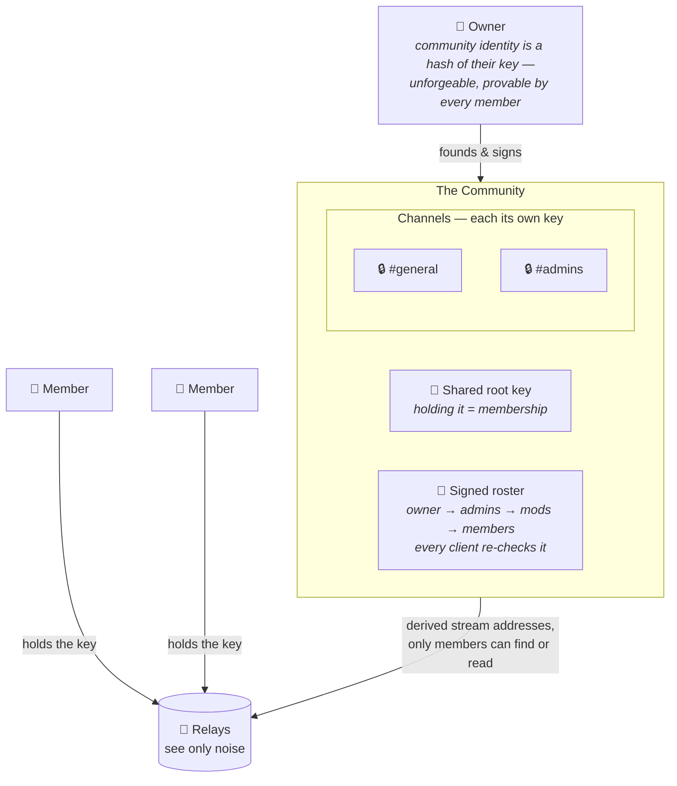

# Concord

**Discord-style communities, end-to-end encrypted, with no server in the middle.**

Concord is a protocol for running communities and channels — what Discord calls *"servers"* — over [Nostr](https://github.com/nostr-protocol/nostr), with no company, no central server, and no computer in the middle that holds your messages or decides who's in charge.

## Why Concord?

Every group chat you've ever used has a computer in the middle. It holds every message, knows every member, and is the final authority on who can do what. You trust it to stay online, keep your data private, and never turn on you. It can be subpoenaed, hacked, sold, or switched off — and when it is, your community dies with it.

Concord deletes that computer. The three jobs a central server does get split into pieces that need to trust nobody:

- **Storage & delivery** → dumb, interchangeable **relays** that only ever see encrypted blobs addressed to rotating, meaningless labels. One misbehaves? Use the others.
- **"Who's a member?"** → **key possession.** If you can decrypt the room, you're in it. There is no list to enforce.
- **"Who's in charge?"** → a **signed roster** rooted in the owner's identity. Authority is math every member re-checks for themselves, not a power a server grants.

The result: full Discord-shaped moderation — owners, admins, roles, kicks, bans — but authority is a *signed list everyone can verify*, and messages are sealed so that relays, network observers, and non-members see only noise.

## The Specs

Concord is defined by a series of **CORD** documents. Like Nostr's NIPs, each is a small, self-contained piece that composes into the whole.

| CORD | Title | What it does |
|---|---|---|
| [01](01.md) | Private Streams | The base primitive: a shared-key stream of NIP-59 giftwraps, readable by anyone holding the key, invisible to everyone else. |
| [02](02.md) | Communities | Ties channels into one membership and authority model. Defines the self-certifying `community_id`, the `community_root` access key, epochs, and the Control/Chat/Guestbook planes. |
| [03](03.md) | Channels | Public and Private rooms, each its own sealed plane with its own key derived from the community. |
| [04](04.md) | Roles | Granular, ranked, owner-rooted permissions (Admin, Mod, custom) — validated by every client, enforced by rejection, not by a server. |
| [05](05.md) | Invites | Shareable links whose keys live in an encrypted bundle on relays; the link carries only a locator and an unlock token, so invites revoke without re-keying. Links travel out-of-band, or over Nostr itself as giftwrapped Direct Invites. |
| [06](06.md) | Rekeys & Refoundings | Post-removal secrecy: rotate a channel's key to cut off a removed member, or re-found the whole community at a new epoch to ban someone for real. |

For a non-normative, at-a-glance reference, [examples.md](examples.md) shows example JSON for every event kind in the registry (CORD-02, Appendix B).

## How it works, at the simplest level

A community is just a **shared key** (holding it *is* membership), a **signed roster** anyone can verify, and a handful of **relays** that only ever carry sealed blobs.

Authority is a signature, not a switch — a forged "ban" is simply dropped because it doesn't trace to the owner. And removing someone for real means **changing the locks**: the community rolls to a new key handed only to who's left.

## Compared to other solutions

Concord isn't the only way to do private messaging on Nostr. It's built for one specific shape — large, Discord-style communities — that the others don't target.

- **[NIP-17](https://github.com/nostr-protocol/nips/blob/master/17.md) (private DMs).** Can't do communities — multi-member rooms are an afterthought, and it's vulnerable to DoS issues. Concord is built for communities from the ground up.
- **[NIP-29](https://github.com/nostr-protocol/nips/blob/master/29.md) (relay-based groups).** You have to self-host an entire server just to start a community, and messages are **not** end-to-end encrypted. Concord needs no server: relays see only noise, and authority is a signed roster every member verifies.
- **[Marmot](https://github.com/marmot-protocol/marmot) (MLS on Nostr).** Uses [MLS](https://www.rfc-editor.org/rfc/rfc9420.html) for forward secrecy and post-compromise security — ideal for small, high-stakes groups. But MLS advances in lockstep (ordered commits, per-device key packages, O(log n) cost per change), which is heavy for large, casual, high-churn rooms. Concord trades those ratcheting guarantees for asynchronous, fold-anytime state that scales to a public community.
- **[Iris Chat](https://irischat.org/) (Double Ratchet chats).** For much the same reasons as Marmot, it aims to replace Signal more than Discord — pairwise ratcheted chats rather than owner-rooted communities.

In short: **NIP-17 is for DMs, NIP-29 trusts the relay, Marmot and Iris Chat secure the small ratcheted group — Concord is built for the scale and shape of a public community.**

## Status

Concord is an evolving specification. The CORD documents above are the source of truth. Contributions, questions, and review are welcome.
